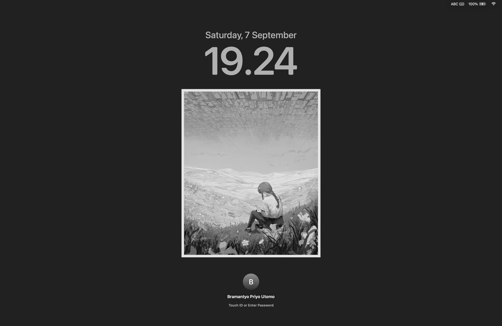
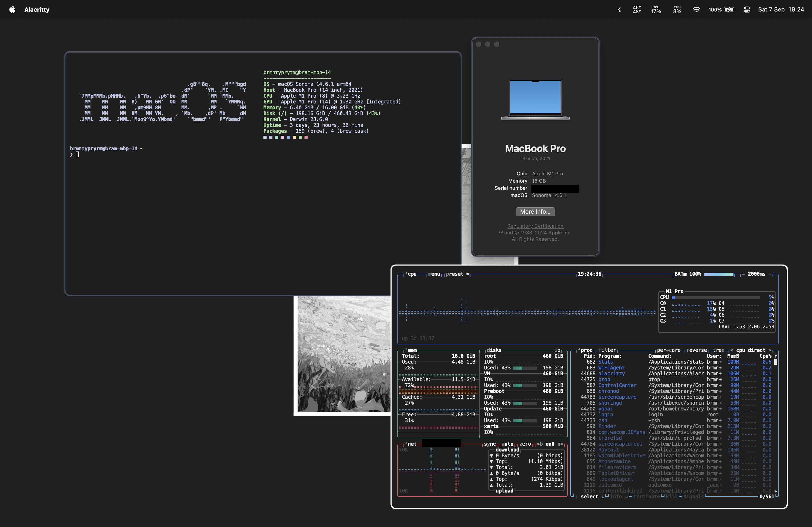

# macOS "rice"
Had the most brilliant idea of tinkering with my computer during last semester's finals week (not recommended) and thought why not finish the job? 

Behold, my dotfiles, only the most important ones at least, you know how cluttered your $HOME directory could be.

Could have used stow for better symlink management, maybe in the future.

## images (results may vary)

- 

- 
