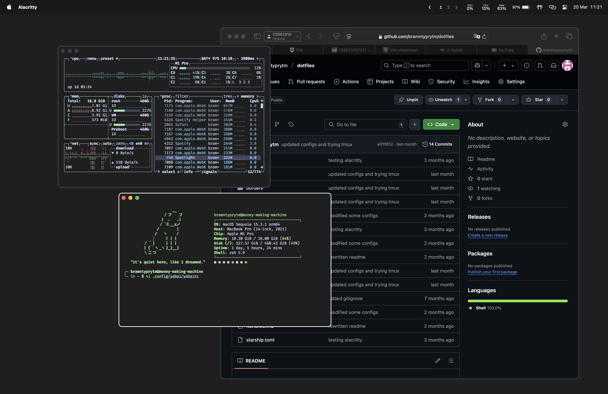
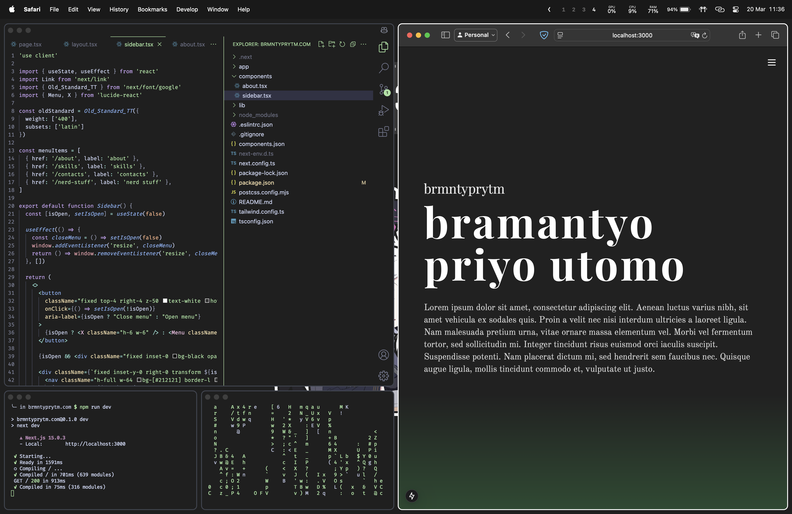
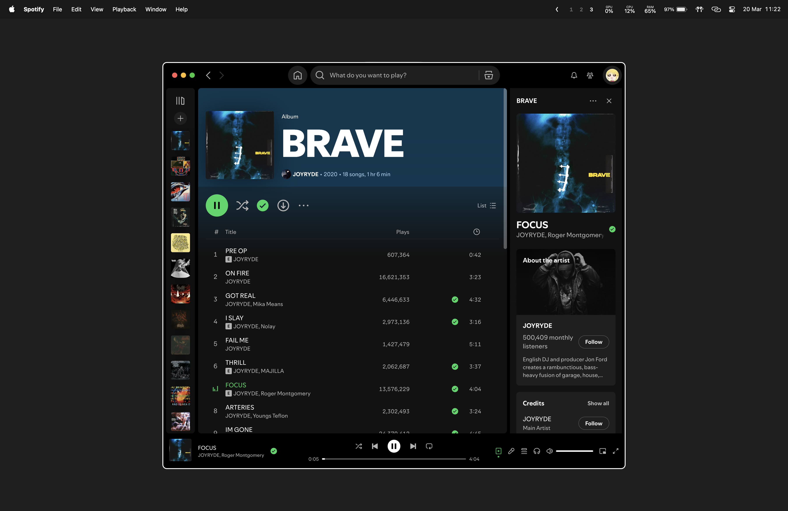

# Dotfiles
None of this stuff makes me a better programmer, but damn does it feel good to have your screen look like you know your stuff, macOS is so fun to tinker with.

## Light "rice" Showcase

### Configs Used in Showcase
- [yabai](https://github.com/koekeishiya/yabai)
- [skhd](https://github.com/koekeishiya/skhd)
- [cmatrix](https://github.com/abishekvashok/cmatrix)
- [alacritty](https://github.com/alacritty/alacritty)
- [alacritty-catpuccin-theme](https://github.com/catppuccin/alacritty)(slightly modified)
- [btop](https://github.com/aristocratos/btop)
- [btop-catpuccin-theme](https://github.com/catppuccin/btop)(slightly modified)
- [fastfetch](https://github.com/fastfetch-cli/fastfetch)
- [source-wallpaper](https://www.pixiv.net/en/artworks/116399382)
